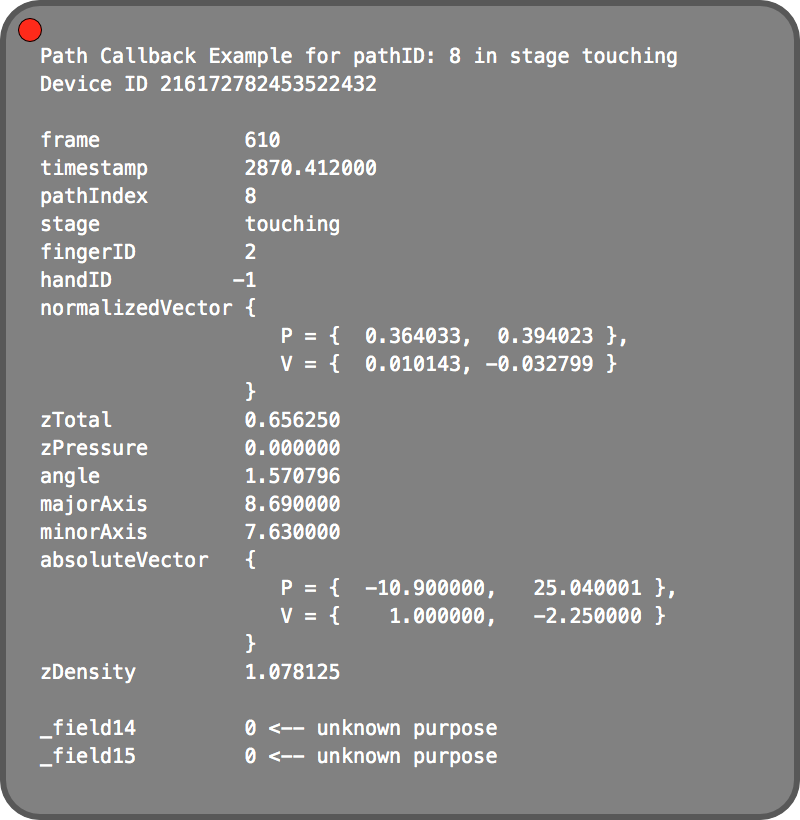
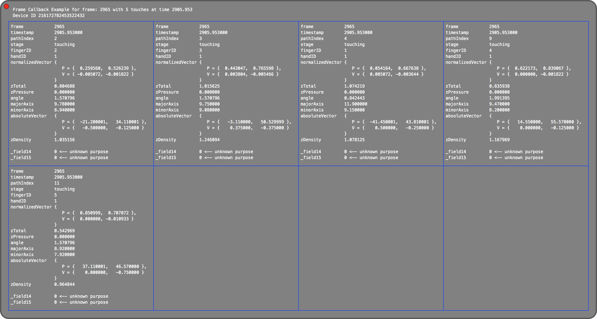

Examples
========

This directory contains examples of both the path callback and frame callback for this module.  Copy `rawFrameInfo.lua` and `rawPathInfo.lua` into your Hammerspoon configuration directory after install this module.

### rawPathInfo

~~~lua
p = dofile("rawPathInfo.lua")
~~~

This callback shows the current state of a single touch at a time.

This will display a panel which displays the information returned to the path callback function for your default (first) multi touch device.  Initially it will be empty, but as you touch it you should see something similar to this:

If you wish to test additional devices (if you have multiple multi touch devices), you can type in the following:

~~~lua
p.stop() -- or click on the red dot in the upper left corner of the displayed information panel.
p.start(2) -- for the second device reported by `hs._asm.undocumented.touchdevice.devices()`, etc.
~~~

### rawFrameInfo

~~~lua
f = dofile("rawFrameInfo.lua")
~~~

This callback shows all of the current touches at a point in time.

This will display a panel which displays the information returned to the frame callback function for your default (first) multi touch device.  Initially it will be empty, but as you touch it you should see something similar to this:

If you wish to test additional devices (if you have multiple multi touch devices), you can type in the following:

~~~lua
f.stop() -- or click on the red dot in the upper left corner of the displayed information panel.
f.start(2) -- for the second device reported by `hs._asm.undocumented.touchdevice.devices()`, etc.
~~~
